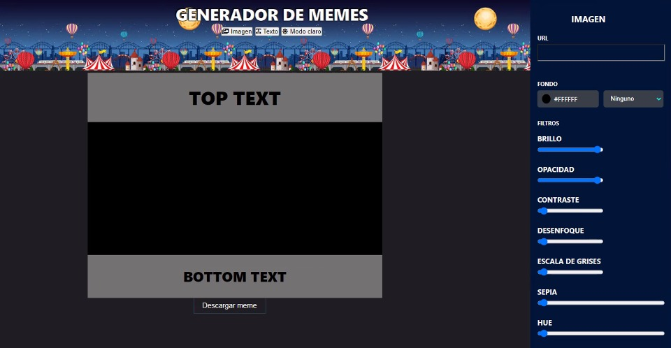

# 🎈Editor de memes by: Sara Muriega 🎈

### En este editor podrás disfrutar y crear los memes que desees!

#### Este Proyecto fue realizado como evaluacion final del modulo 2 del curso de desarrollo FrontEnd Ada, utilizando HTML, CSS y JavaScript.
 

### 📌No pierdas más tiempo! Si quieres PROBARLO hace click [acá](https://github.com/SaraMur/generadorMeme))
### Podes disfrutarlo en modo claro 💡:   

 

### Podes disfrutarlo en modo oscuro 🕶:   

 

*

# Pasos para la instalación 👀 👇

 - Ir al [repositorio](https://github.com/SaraMur/generadorMeme)

 - Dale click al botón de forkear 

 - Darle click al botón de code

 - Copia la URL

 - Abrir tu terminal y poner el comando de 
  git clone  <url> 

 - Entrar a la carpeta del proyecto y abrirlo en tu IDE
 
 

*

### De Sara 💘